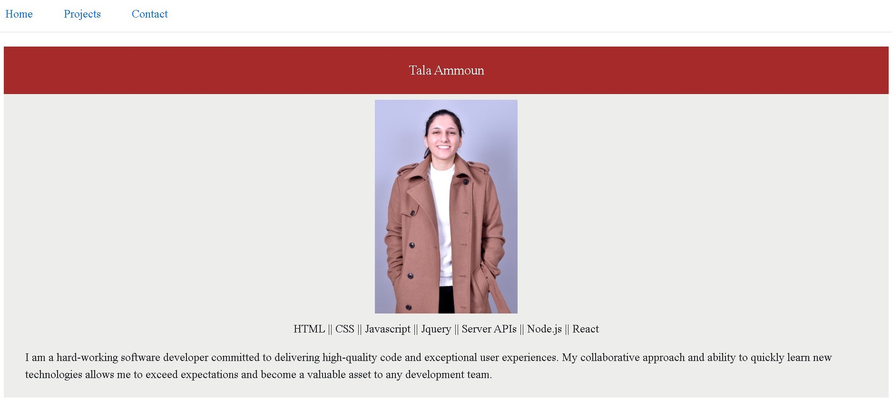

# Module 13 Challenge: React Portfolio

## Description

The bootcamp challenge for this week was to create an application using React that showcases my skills to potential employers and sets me apart from other developers, whose portfolios may not contain some of the latest technologies.

## Installation

You can install this app by cloning the GitHub repository to your local computer. Copy the HTTPS link found under the “code” tab. Open Git Bash and run the command “git clone” then pasting the GitHub link. Run the command “code .” to open the files in VS Code. 

## Usage

You can use the app by right clicking on the "Portfolio" folder and opening it in integrated terminal. 

First create a new starter React app by running the command
```
npx create-react-app Portfolio
```

cd into "Portfolio", then download bootstrap, axios, and react router dom by running the command

```
npm install bootstrap axios react-router-dom
```

Finally, test the app by running the command
```
npm start
```

## End Result:

You can find the link to the deployed live webpage here: 
https://github.com/Tala-Ammoun/Portfolio/deployments/activity_log?environment=github-pages


## Credits

N/A 

## License

Licensed under the MIT license.