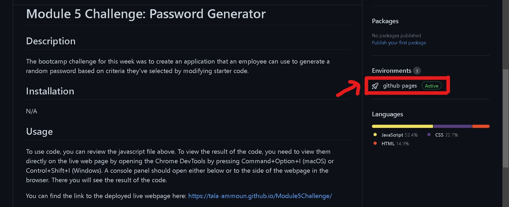
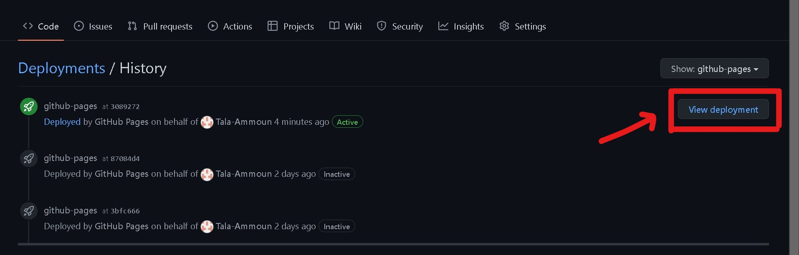

# Module 13 Challenge: React Portfolio

## Description
 
Now that you've worked with React and have multiple projects to share, it's time to develop the initial scaffolding for your first portfolio site, as well as create or update other materials so that you can showcase your skills to potential employers. Creating a portfolio using React will help set you apart from other developers whose portfolios do not use some of the latest technologies.

The bootcamp challenge for this week was to create an application using React that showcases my skills to potential employers and sets me apart from other developers, whose portfolios may not contain some of the latest technologies.

## Installation

N/A

## Usage

To use code, you can review the javascript file above. To view the result of the code, you need to view them directly on the live web page by opening the Chrome DevTools by pressing Command+Option+I (macOS) or Control+Shift+I (Windows). A console panel should open either below or to the side of the webpage in the browser. There you will see the result of the code.

You can find the link to the deployed live webpage here: 
https://github.com/Tala-Ammoun/Portfolio/deployments/activity_log?environment=github-pages

## End Result:

You can access the link using the following steps:

### Step 1

### Step 2

## Credits

N/A 

## License

Licensed under the MIT license.